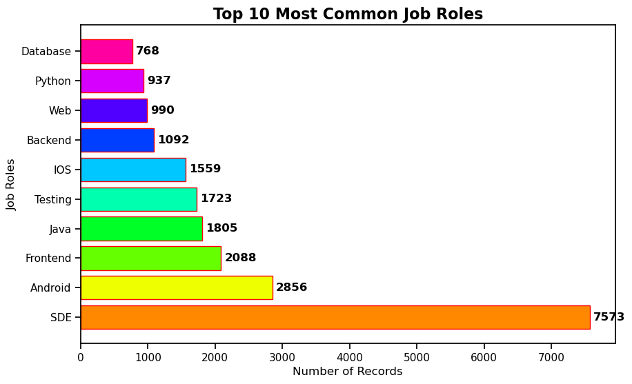

# Salary Data Analysis & KPI Dashboard

## Project Overview

This project analyzes salary data from the technology industry to uncover trends in compensation, job demand, and geographic salary differences. Using data analysis and visualization techniques, the project transforms raw salary data into a KPI dashboard that highlights key insights about the technology job market.

---

# Project Objectives

* Analyze salary distribution across technology roles.
* Identify the highest-paying job roles in the dataset.
* Examine job demand based on the frequency of job roles.
* Compare salary levels across major technology cities.
* Explore the relationship between company ratings and salaries.
* Build a KPI dashboard to visualize salary trends and insights.

---

# Dataset Information

The dataset contains salary information from technology companies with the following variables:

| Column            | Description                            |
| ----------------- | -------------------------------------- |
| Rating            | Company rating by employees            |
| Company Name      | Name of the company                    |
| Job Title         | Job title                              |
| Salary            | Salary offered                         |
| Salaries Reported | Number of salary reports               |
| Location          | Job location                           |
| Employment Status | Full-time, Intern, Contractor, Trainee |
| Job Roles         | Type of technical role                 |

Dataset size:

* **22,000+ records**
* **11,000+ companies**

---

# Exploratory Data Analysis (EDA)

Main analysis steps include:

1. Data cleaning and preprocessing
2. Salary distribution analysis
3. Job role salary comparison
4. Location-based salary comparison
5. Rating vs salary analysis
6. Employment status salary comparison

---

# KPI Dashboard

The dashboard includes several visualizations:

## Salary Analysis

* Salary Distribution
* Salary by Job Role
* Salary by Location

## Market Insights

* Most Common Job Roles
* Employment Status vs Salary

## Company Insights

* Rating vs Salary

---

# Key Insights

1. **Software Development Engineers dominate the job market.**
2. **Database engineers and backend developers have the highest salaries.**
3. **Tech hubs like Mumbai and Bangalore offer higher salaries.**
4. **Full-time employees earn significantly more than interns.**
5. **Companies with higher ratings tend to offer better salaries.**

---

# Business Recommendations

1. Job seekers should focus on **high-demand engineering roles**.
2. Companies should **benchmark salaries** to remain competitive.
3. Tech professionals seeking higher pay should target **major tech cities**.
4. Organizations should improve **employee satisfaction** to attract talent.

---

# Tools Used

| Tool             | Purpose                 |
| ---------------- | ----------------------- |
| Python           | Data analysis           |
| Pandas           | Data cleaning           |
| Seaborn          | Data visualization      |
| Matplotlib       | Charts                  |
| Jupyter Notebook | Development environment |

---

# Project Outcome

This project transforms raw salary data into a KPI dashboard and actionable insights, helping to better understand compensation trends in the technology job market.

---

# Skills Demonstrated

* Data Cleaning
* Exploratory Data Analysis
* Data Visualization
* KPI Dashboard Design
* Business Insight Generation

## Dashboard Preview

## Dashboard Preview

### Salary Distribution

### Top Paying Roles

### Salary by City

### Full Dashboard

